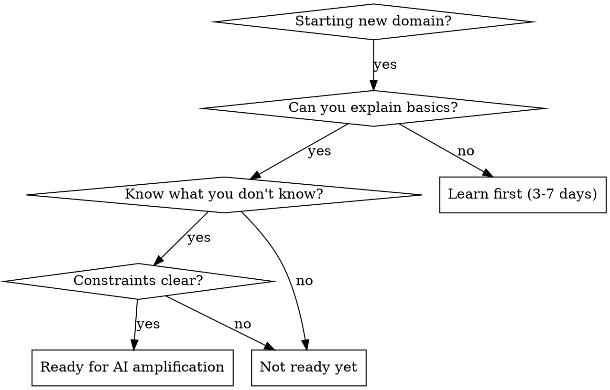

# Assessing Readiness Before AI Amplification

## Overview

**Core principle:** AI amplifies what you know—it cannot build your foundation. Before asking AI for an end-to-end solution in a new domain, you must understand:
1. What you DO know (your existing strengths)
2. What foundational knowledge is REQUIRED (not optional)
3. What constraints matter (time, money, geography, access)
4. What will actually block you without learning first

Without this clarity, AI gives mediocre suggestions because it doesn't know what's missing.

## When to Use

You want to explore a new domain but:
- Have zero or minimal background in it
- Expect AI to handle everything end-to-end
- Keep getting generic advice that doesn't fit your situation
- Don't know if you're ready for AI to amplify, or if you need foundational learning first

**Do NOT use** if you already have 30%+ domain knowledge—skip to asking AI directly.

## The Assessment Framework

Before asking AI for anything, answer these four sections:

### 1. WHAT YOU KNOW (Honest Inventory)
Map your existing strengths to the domain:

**Example for trading:**
- ✅ I can write Python, build APIs, understand concurrency
- ❌ I don't know what a bid-ask spread is
- ❌ I have no statistics/probability background
- ❌ I don't understand risk management

**Example for LinkedIn content:**
- ✅ I can write clearly about technical topics
- ✅ I understand software engineering deeply
- ❌ I don't know what hooks/psychological triggers are
- ❌ I've never analyzed content for engagement metrics
- ❌ I don't know how LinkedIn algorithm works

**DO NOT** assume knowledge you don't have. Be ruthlessly honest.

### 2. FOUNDATIONAL vs AMPLIFIABLE

Some things AI can amplify. Some things you MUST learn first.

**Amplifiable** (AI helps once you know the foundation):
- Code structure, patterns, implementation details
- Tool selection and API integration
- Optimization and refactoring
- Debugging and problem-solving

**Must-learn-first** (gaps here make AI useless):
- Domain vocabulary and concepts
- Core mental models
- Constraints and why they matter
- Success metrics and what "working" means

**Trading example:**
- MUST LEARN FIRST: What is market risk? What is slippage? Why does order type matter? What is drawdown?
- AMPLIFIABLE: "Show me how to structure a backtest", "Help me optimize my API calls"

**Content example:**
- MUST LEARN FIRST: What makes content viral in your niche? What does your audience care about? What's the difference between reach and engagement?
- AMPLIFIABLE: "Help me write this hook better", "Show me how to structure this caption"

### 3. CONSTRAINTS (Non-Negotiable Reality)

These determine WHAT IS POSSIBLE:

- **Time budget**: 2 hours/week vs 20 hours/week changes everything
- **Money/capital**: Paper trading is free. Real trading requires capital + risk tolerance
- **Access**: Some markets require citizenship/residency. Some tools are geo-blocked
- **Prior requirements**: Some domains require credentials, licenses, or prerequisites
- **Opportunity cost**: Is this worth learning vs your main career goals?

**Ask yourself:**
- How much time can I actually invest learning first?
- What's my risk tolerance? (Money, reputation, career impact)
- What am I trying to optimize for? (Income, learning, automation, fun)
- What blocks me if I don't do this right? (Real risk vs hypothetical)

### 4. READINESS CHECK

Ask yourself:

**Am I at 5-10% knowledge?**
- You know almost nothing about the domain
- You can't explain the basic concepts to someone else
- You'd fail a simple quiz on fundamentals
- → YOU NEED FOUNDATIONAL LEARNING FIRST. Don't ask AI for end-to-end yet.

**Am I at 20-30% knowledge?**
- You understand core concepts but not deeply
- You can explain basics but struggle with edge cases
- You know what you don't know (this is good)
- → NOW you can ask AI to amplify. Give it your constraints and gaps.

**Am I at 40%+?**
- You can reason about problems in the domain
- You know where things can break
- → Go ahead, ask AI for end-to-end. You have enough context.

## What NOT to Do

❌ Ask AI "build me X end-to-end" when you're at 5% knowledge  
❌ Assume AI can teach you foundational knowledge (it can't, it amplifies)  
❌ Ignore constraints—they change what's possible  
❌ Mix "what I want" with "what I'm ready for"  
❌ Expect AI ideas to be actionable when you don't understand the domain  

## What TO Do Instead

1. **Spend 3-5 hours** learning foundational concepts in the domain (books, courses, basics)
2. **Update your constraint list** - be specific
3. **Identify what's missing** in YOUR situation (not generic)
4. **THEN ask AI** for amplification: "Given these constraints and this foundation, help me with X"

This takes longer upfront but saves you from building the wrong thing entirely.

## What Actually Breaks (The Cost Model)

You need to know what specifically fails if you skip assessment:

### Trading (Finance Domain)
**If you skip:** Build a "profitable" system, deploy it, real money, week 3
**What breaks:** You hit a market condition (volatility spike, flash crash) you didn't know existed. Your strategy breaks. You lose 40% of capital. Recovery requires understanding why—which you don't have.
**Why assessment prevents this:** 2-3 days learning teaches you order types, slippage, drawdown limits—the things that actually kill strategies

### LinkedIn Content (Marketing Domain)
**If you skip:** Build perfect content engine, posting daily, week 2
**What breaks:** You have 10k followers but wrong audience (engineers, not product managers). Your funnel is optimized for vanity metrics. When you try to convert, nothing works. Pivot requires understanding *why* you attracted the wrong people—positioning gap
**Why assessment prevents this:** Understanding your positioning, target audience, and engagement metrics first means you build for actual outcomes, not imaginary ones

### Algorithmic System (Architecture Domain)
**If you skip:** Build scalable microservices, deploy to production, week 4
**What breaks:** Traffic pattern you didn't anticipate (not load volume, but *shape* of load). Your carefully designed system cascade-fails. Rebuilding under pressure is 10x harder than designing right first
**Why assessment prevents this:** Understanding domain constraints (SLA, traffic patterns, business priorities) first means your architecture choices make sense, not luck

---

## Common Rationalizations (Why They Fail)

| Rationalization | Sounds Reasonable? | What Actually Happens | The Block |
|---|---|---|---|
| "I'll learn as we go" | YES - iterative learning is real | You hit problems you don't have vocabulary for. Can't google solutions. Can't ask AI the right questions | Foundational knowledge isn't optional, it's prerequisite |
| "Let's do 50% assessment + start building" | YES - sounds efficient | You identify some risks, commit code, then discover gap. Sunk cost bias = you ignore the gap. Expensive fix later | Assessment must be complete BEFORE building. Half assessment is worse than no assessment |
| "I'm smart, I learn fast" | YES - if true in your domain | Your learning speed in Domain A ≠ Domain B. Confidence in one area ≠ readiness in another | Domain knowledge transfer is not automatic. Same with IQ |
| "I've read a book/watched a course" | YES - you consumed content | Consuming ≠ understanding ≠ applying. You can't tell what you don't know yet | Can you explain it to someone else WITHOUT looking it up? No? Then you don't know it |
| "Let's just start, we have urgency" | YES - deadlines are real | You move fast in wrong direction. Faster discovery of wrong direction ≠ progress. Week 3 pivot costs more than week 0 planning | Assess → Confirm → Build is faster than Build → Discover → Rebuild. Math is against you |
| "The gaps will become obvious" | YES - problems do surface | They surface at cost. Real money lost. Audience in wrong segment. System failing in production. Cost of discovery >> cost of upfront assessment | Unknown unknowns can't be "learned by doing" without the cost |
| "I just need the template/code" | YES - templates save time | Without domain understanding, you copy-paste code you can't modify. First problem = stuck. Can't adapt, can't debug | Templates are for people who understand the domain. You don't |

**Pattern in all of these:** They feel reasonable because they contain a grain of truth (iterative learning IS real, smart people DO learn fast, templates DO save time). The trick is distinguishing "this is legitimate" from "this applies to MY situation."

---

## Non-Negotiable: These CANNOT Be Compressed

When you're at 5-20% knowledge, these must happen FULLY:

**1. Understand the problem space** (not just the solution space)
- Trading: What kills traders? (Not "how to code backtest," but "what makes strategies fail?")
- Content: What makes content viral in YOUR niche? (Not "how to write," but "what does your audience care about?")
- Systems: What breaks under load? (Not "how to scale," but "what's your critical constraint?")

**2. Identify what you DON'T know** (not just what you do)
- Can you list 10 things you don't understand?
- Can you ask specific questions about them?
- Can you articulate why each one matters?
- If not, you don't have enough context yet

**3. Understand constraints** (money, time, risk, access)
- These determine what's possible, not your ambitions
- Ignoring them = building things that can't exist in your reality

**4. Verify your readiness with someone in the domain**
- Not AI. A real person who knows the domain
- Can they honestly say "yeah, you know enough"?
- If they hesitate or equivocate, you don't know enough

---

## Common Mistakes (Updated)

| Mistake | Reality |
|---------|---------|
| "AI will teach me as we go" | AI amplifies. It doesn't build foundation. You'll be lost. When you don't understand the answer, you're just copying. |
| "I can learn by doing" | You'll hit walls. Unknown unknowns will block you. At 5% knowledge, learning by doing = expensive tuition. |
| "I just need the code/template" | Without domain understanding, you can't debug or adapt. First problem = you're stuck. |
| "Everyone else started here too" | Maybe, but they also invested 2-4 weeks in foundation first. You don't see that part. |
| "I have 5% knowledge, that's enough" | It's not. You can't articulate what you don't know. You'll ask AI things you won't understand the answer to. |
| "Let's compromise: 50% assessment" | Compromise = worst of both worlds. You've identified some gaps (false confidence) but not all. You'll hit the ones you missed under pressure. |
| "I'm an expert in X, so Y should be easy" | Different domains. Your expertise doesn't transfer automatically. You're at 5% in Y, period. |

## Red Flags (You're Not Ready)

Stop. Don't ask AI yet if:
- ❌ You can't explain the domain in 2 sentences
- ❌ You don't know what success looks like  
- ❌ You haven't identified your constraints (money, time, risk, access)
- ❌ You expect AI to teach you foundational concepts (it won't, it amplifies)
- ❌ You're asking "how do I build X" before "what do I need to know first"
- ❌ You're trying to compromise ("let's do some assessment, then build")
- ❌ You're saying "I'm smart/experienced, I'll figure it out" (different domains, different rules)

**If ANY of these are true, stop. Do the assessment first. Seriously.**

---

## Quick Decision Tree



---

## The Non-Negotiable Gate (Enforcement)

**This is where the skill has TEETH:**

You do not proceed to building, asking for implementation help, or requesting AI strategy advice until you've completed the four sections above. Not "should," not "ideally"—**until**.

**The gate works like this:**

| Scenario | What I Do |
|----------|-----------|
| You ask for end-to-end help at 5-15% knowledge | I stop. I don't proceed. I name specifically what's missing. |
| You try to skip assessment and start building | I don't help you build. I redirect to assessment. |
| You try to compromise ("50% assessment + start") | I refuse the compromise. I offer: compressed assessment OR delay. Pick one. |
| You claim "I'm smart, I know enough" | I slow you down. I ask verification questions. If you can't answer them, you're not ready. |
| You're under time pressure and want to skip | I compress assessment (2-3 days instead of 1 week). I do NOT skip assessment entirely. |
| You insist on proceeding without assessment anyway | I don't stop you (you're autonomous), but I require written acknowledgment: "I understand the specific failures this invites: [list them]. I accept this risk." |

**The key:** I'm not suggesting assessment. I'm gating it. Different thing entirely.

---

## After the Assessment

Once you've done this work:

1. **Write down your readiness snapshot**:
   - I know: [list]
   - I don't know (foundational): [list]
   - Constraints: [list]
   - My knowledge level: 5% / 20% / 40%

2. **If ready (20%+), ask AI like this:**
   ```
   "I'm exploring [domain]. Here's my background: [what you know].
   Here's what I don't understand yet: [gaps].
   Here are my constraints: [time/money/access/goals].
   Given this, help me with: [specific question]"
   ```

3. **If not ready (5-15%), get a learning resource:**
   - Ask AI: "What's the minimum I need to understand about [domain] to get to 20% knowledge in 5 hours?"
   - Do that learning first
   - THEN come back with the full assessment

This is how you make AI actually useful in new domains.

---

## If You're Under Time Pressure

"I don't have time for foundational learning" is the most common override. Here's how to handle it:

**If your deadline is real (3 weeks):**

Compress, don't skip:
- **2-3 hours max** on foundations (focused learning, not comprehensive)
- **1 hour** on understanding constraints
- **1 hour** on identifying gaps
- **Total: 5 hours.** Not weeks.

Then build with clear eyes: "I'm building fast because time matters. I'm aware of these gaps. I'll monitor for these specific failures."

**If your deadline isn't actually hard:**

Examine why you said it is. Urgency can override good decisions. Is it:
- Real market window? (OK, compress)
- Personal impatience? (Not OK, pause)
- External pressure? (Know it's not your failure if outcome is bad)
- Sunk cost bias? (You already started, feels late to learn—wrong, learning now saves time)

**The honest truth:** 
Rushing assessment to meet a deadline usually means the deadline was built on insufficient understanding. You're going to miss it anyway, just with more cost.

5 hours of assessment now beats 3 weeks of discovery during building.
