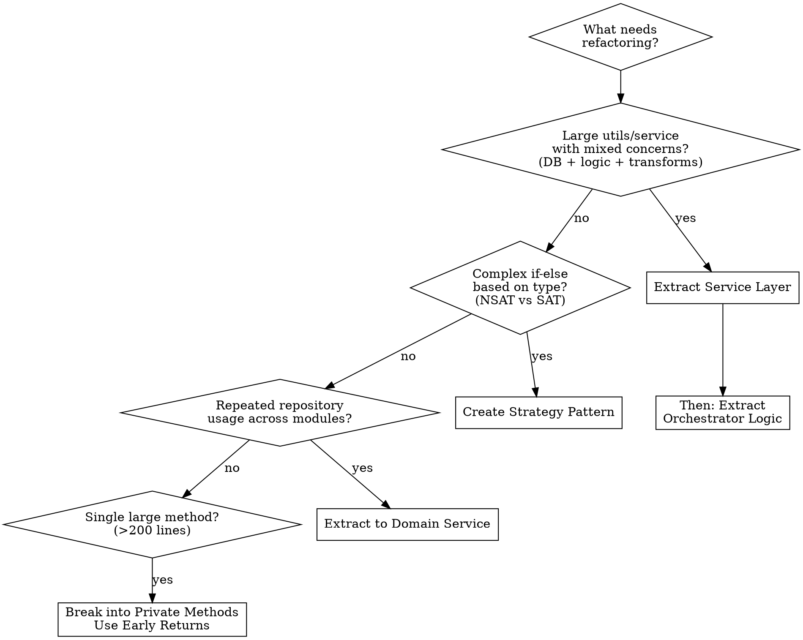

# Codebase Refactoring Skill

## Overview

**Core principle:** Refactor complex code into clear architectural layers (Controller → Orchestrator → Service → Repository) where each layer has a single responsibility.

When refactoring code in this codebase, follow this guide to ensure consistency with the established architecture.

---

## 1. Understand Current Architecture

Before refactoring, read these knowledge base files to understand the patterns:

| Document | Purpose |
|----------|---------|
| `knowledge-base/architecture_reference.md` | Core patterns, layer responsibilities, decision trees |
| `knowledge-base/folder_structure.md` | Where code lives, naming conventions |
| `knowledge-base/new_api_creation_guide.md` | Step-by-step templates for new code |

---

## 2. Identify Refactoring Candidates

### Code Smells to Look For

| Smell | Indicator | Action |
|-------|-----------|--------|
| **God Method** | Method > 200 lines | Extract to orchestrator + services |
| **Deep Nesting** | `if` depth > 4 | Early returns, strategy pattern |
| **Repeated Queries** | Same query in multiple places | Extract to service layer |
| **Business Logic in Utils** | Utils with DB access | Move to orchestrator |
| **Type-Based If-Else** | `if (type === 'A') {...}` | Strategy pattern |
| **Repository in Multiple Modules** | Same repo everywhere | Create service layer |

### Files Flagged for Refactoring

```
🔴 src/modules/rank-scholarship/rank-scholarship.v2.service.ts (2186 lines)
🔴 src/modules/rank-scholarship/rank-scholarship.utils.ts (~1050 lines)
🟡 src/modules/scholarship/user-registration/user-registration.orchestrator.ts (510 lines)
```

### When NOT to Use

**Don't use this skill for:**
- ❌ Code already following the Module-Orchestrator-Service pattern
- ❌ Simple functions (<50 lines) with single responsibility
- ❌ Quick bug fixes that don't require structural changes
- ❌ Performance optimization without architectural changes
- ❌ Adding minor features to well-structured code
- ❌ External library code or node_modules

---

## 3. Refactoring Decision Tree



---

## 4. Where to Write New Code

### Service Layer (Data Operations)
**Location:** `src/services/{domain}/{service_name}/`

Create here when:
- ✅ New database collection
- ✅ Data operations used by multiple modules
- ✅ External API wrapper (reusable)

**Structure:**
```
src/services/scholarship/{service_name}/
├── entity/
│   └── {entity}.entity.ts          # Database schema
├── repository/
│   └── {entity}.repository.ts      # Database operations
├── {service}.service.ts            # ⭐ Public API (stateless)
└── {service}.module.ts             # Exports service
```

### Module Layer (Business Logic)
**Location:** `src/modules/{module-name}/`

Create here when:
- ✅ New API endpoints
- ✅ Business workflow coordinating services
- ✅ Complex business rules

**Structure:**
```
src/modules/{module-name}/
├── controllers/
│   └── {feature}.controller.ts     # API routing
├── dto/
│   └── {operation}.dto.ts          # Request/Response validation
├── {module}.orchestrator.ts        # ⭐ Business logic
└── {module}.module.ts              # Wires everything
```

### Strategy Layer (Algorithm Variations)
**Location:** `src/services/{domain}_strategy/`

Create here when:
- ✅ Same interface, different implementations
- ✅ Type-based algorithm variations
- ✅ Open/Closed principle needed

**Structure:**
```
src/services/scholarship_strategy/
├── scholarship-strategy.ts          # Interface definition
├── nsat-calculation.strategy.ts     # NSAT implementation
├── sat-calculation.strategy.ts      # SAT implementation
├── scholarship-strategy.factory.ts  # Factory to create strategies
└── scholarship_strategy.module.ts   # Exports factory
```

---

## 5. Refactoring Patterns

### Pattern 1: Extract Service from Repository

**Before (scattered):**
```typescript
// In multiple orchestrators
const data = await this.db.userRegistrationRepo.findById(id);
const enriched = await this.enrichWithUser(data);
```

**After (centralized):**
```typescript
// Create: src/services/scholarship/user_registration_v3/
@Injectable()
export class UserRegistrationDataService {
  async findById(id: string) {
    return await this.repository.findById(id);
  }
  
  async findByIdWithUser(id: string) {
    const data = await this.findById(id);
    return await this.dataComposer.enrichWithUser(data);
  }
}
```

### Pattern 2: Extract Orchestrator from Utils

**Before (utils with business logic):**
```typescript
// rank-scholarship.utils.ts (1000+ lines)
export class RankScholarshipUtils {
  static async calculateScholarship(...params /* 15+ parameters */) { /* business logic */ }
  static async buildResponse(...params /* 12+ parameters */) { /* transformations */ }
}
```

**After (separated):**
```typescript
// orchestrator handles business logic
@Injectable()
export class ScholarshipCalculationOrchestrator {
  async calculate(params) {
    // Business rules
    const needsCalc = phase?.isRankCalculated && !userReg?.scholarship;
    if (needsCalc) return await this.doCalculation(...);
    // Use service for stateless transformation
    return this.userRegService.buildResponse({...});
  }
}

// service has stateless helpers
@Injectable()
export class UserRegistrationDataService {
  buildResponse(params: BuildResponseParams) {
    // Pure transformation, no DB calls
  }
}
```

### Pattern 3: Strategy Pattern Extraction

**Before (type-based if-else):**
```typescript
async getExpiryInfo(resultType, phase) {
  if (resultType === 'SCHEDULE') {
    // 50 lines NSAT logic
  } else if (resultType === 'INTERVAL') {
    // 50 lines SAT logic
  }
}
```

**After (strategy pattern):**
```typescript
// Interface
interface IScholarshipStrategy {
  getExpiryInfo(params): Promise<ExpiryInfo>;
}

// NSAT Strategy
class NSATStrategy implements IScholarshipStrategy {
  async getExpiryInfo(params) { /* NSAT logic */ }
}

// SAT Strategy  
class SATStrategy implements IScholarshipStrategy {
  async getExpiryInfo(params) { /* SAT logic */ }
}

// Usage in orchestrator
const strategy = this.strategyFactory.create(resultType);
const expiry = await strategy.getExpiryInfo(params);
```

---

## 6. Common Mistakes

| Mistake | Problem | Fix |
|---------|---------|-----|
| **Skipping service extraction** | Orchestrator directly accesses repositories | Create service layer first, then refactor orchestrator |
| **Moving logic without tests** | Breaking existing behavior unknowingly | Write integration tests before refactoring |
| **Creating stateful services** | Services storing instance variables | Services should be stateless - pass all data via parameters |
| **Mixing layers** | Controller calling services directly | Controller → Orchestrator → Service → Repository |
| **Over-abstracting too early** | Creating interfaces before 2nd implementation | Wait until you have 2+ implementations before abstracting |
| **Forgetting to update callers** | Old code still calling refactored methods | Search codebase for all references before deleting old code |
| **Ignoring parallel fetching** | Sequential `await` calls for independent data | Use `Promise.all()` for independent operations |
| **Leaving orphaned code** | Unused utils/methods after refactoring | Delete dead code immediately - don't leave commented out |

---

## 7. Refactoring Checklist

### Before Starting
- [ ] Read existing code and understand current behavior
- [ ] Identify all callers of the code being refactored
- [ ] Write integration tests for existing behavior (if missing)
- [ ] Create a refactoring plan document

### During Refactoring
- [ ] Start bottom-up: Service Layer → Orchestrator → Controller
- [ ] Keep services stateless and domain-bounded
- [ ] Use parallel fetching (`Promise.all`) where possible
- [ ] Use early returns to reduce nesting
- [ ] Replace magic strings with enums

### After Refactoring
- [ ] Run build: `npm run build`
- [ ] Run tests: `npm run test`
- [ ] Update `folder_structure.md` if new files added
- [ ] Update `architecture_reference.md` if new patterns used
- [ ] Update `schema_reference.md` if new entities added

---

## 7. Layer Responsibilities (Quick Reference)

| Layer | Location | Responsibility | Injects |
|-------|----------|----------------|---------|
| **Controller** | `modules/.../controllers/` | HTTP routing, guards, DTOs | Orchestrator only |
| **Orchestrator** | `modules/.../orchestrator.ts` | Business logic, workflow | Services, strategies |
| **Service** | `services/.../service.ts` | Data operations, stateless helpers | Repository only |
| **Repository** | `services/.../repository.ts` | Database queries | DatabaseService |
| **Strategy** | `services/..._strategy/` | Algorithm variations | Services |

---

## 8. Common Commands

```bash
# Build check
npm run build

# Run tests
npm run test

# Lint
npm run lint

# Start dev
npm run start:dev
```

