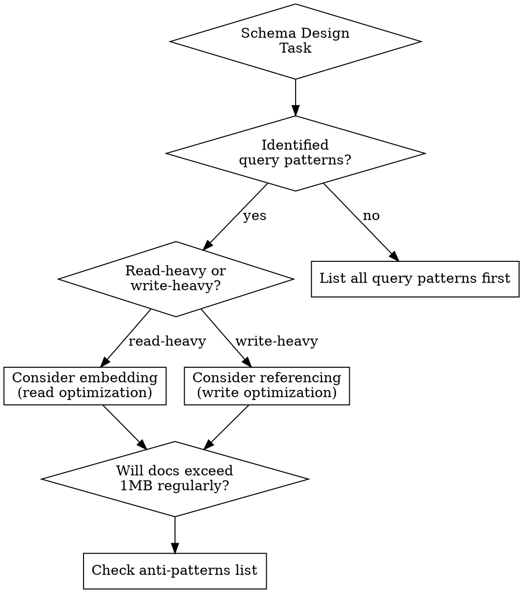

# MongoDB Expert

## Overview

**Core principle:** Systematic, verification-driven approach to MongoDB using checklists, diagnostic tools, and anti-pattern detection.

## When to Use

- Designing schemas for new features
- Slow queries or timeouts in production
- Reviewing aggregation pipelines for performance
- Investigating high CPU/memory usage in MongoDB
- Deciding between embedding vs referencing
- Optimizing indexes

## When NOT to Use

- Basic CRUD operations (already straightforward)
- MongoDB installation or connection issues
- Administrative tasks (backups, replication setup)
- Non-MongoDB database questions

---

## Schema Design Checklist

Before designing, answer these:



### Checklist

- [ ] **List all query patterns** (what queries will run against this data?)
- [ ] **Identify read vs write ratio** (10:1 read-heavy? 1:1 balanced?)
- [ ] **Check document growth** (will it exceed 16MB limit or 1MB comfortable size?)
- [ ] **Embedding vs referencing decision**:
  - Embed if: Always queried together, bounded size, read-heavy
  - Reference if: Queried independently, unbounded growth, many-to-many
- [ ] **Plan indexes** based on query patterns (compound indexes for multi-field queries)
- [ ] **Review anti-patterns list** (see below)
- [ ] **Consider sharding** if dataset > 2GB or high write throughput

---

## Query Optimization Workflow

**ALWAYS follow this order:**

### 1. Diagnose First
```javascript
// Check current operation
db.currentOp({ secs_running: { $gt: 5 } })

// Get existing indexes
db.collection.getIndexes()

// Run explain BEFORE changing anything
db.collection.find({...}).explain("executionStats")
// or
db.collection.aggregate([...], { explain: true })
```

### 2. Identify Issues

| Issue | Symptom in explain() | Fix |
|-------|---------------------|-----|
| **Full collection scan** | `COLLSCAN` stage | Add index |
| **$match after $lookup** | High `nReturned` | Move $match earlier |
| **Missing compound index** | Multiple `IXSCAN` stages | Create compound index |
| **Large in-memory sort** | `SORT` with high memory | Add index on sort field or `allowDiskUse: true` |
| **Unindexed $lookup** | High execution time in `$lookup` | Index foreign field |

### 3. Optimize

**Aggregation pipeline optimization order:**
1. ✅ `$match` FIRST (reduce working set immediately)
2. ✅ `$project` early (reduce document size)
3. ✅ `$lookup` (after filtering)
4. ✅ `$sort` (ensure index supports it)
5. ✅ `$group` (after all filtering)

### 4. Verify Fix
```javascript
// Run explain on fixed query
db.collection.find({...}).explain("executionStats")

// Check key metrics:
// - executionTimeMillis < 100ms
// - totalDocsExamined ≈ nReturned (index selective)
// - stage is IXSCAN not COLLSCAN
```

---

## Query Review Checklist

When reviewing queries (yours or others):

- [ ] **Explain plan run?** (Never deploy without `.explain()`)
- [ ] **Indexes used?** (Check for `IXSCAN`, not `COLLSCAN`)
- [ ] **Projection used?** (Only fetch needed fields)
- [ ] **$match placement** (First stage in aggregations?)
- [ ] **Index selectivity** (`totalDocsExamined / nReturned` close to 1?)
- [ ] **N+1 queries?** (Loop with queries inside? Use `$lookup` or batch with `$in`)
- [ ] **Unbounded arrays?** (Using `$push` without limit?)
- [ ] **Large sorts?** (> 100MB? Need index or `allowDiskUse: true`)

---

## Anti-Patterns to Avoid

| Anti-Pattern | Problem | Solution |
|--------------|---------|----------|
| **Massive arrays** | Arrays with 1000s of elements | Use separate collection with reference |
| **Unbounded growth** | Documents grow forever | Cap array size with `$slice` or reference |
| **Fan-out on write** | One write triggers many updates | Denormalize less or use change streams |
| **$lookup in loop** | N+1 query pattern | Single aggregation with `$lookup` |
| **No projection** | Fetching entire docs when need 2 fields | Always use `{ field: 1 }` projection |
| **Wrong index order** | Compound index (B, A) for query (A, B) | Match index order to query pattern |
| **Sorting without index** | Large `$sort` without index | Index the sort field(s) |
| **Regex without anchor** | `/pattern/` instead of `/^pattern/` | Anchor regex for index use: `/^pattern/` |

---

## Diagnostic Tools Quick Reference

| Tool | Purpose | Command |
|------|---------|---------|
| **Explain** | Understand query execution | `.explain("executionStats")` |
| **Profiler** | Log slow queries | `db.setProfilingLevel(1, { slowms: 100 })` |
| **Current Op** | See running queries | `db.currentOp()` |
| **mongostat** | Real-time server stats | `mongostat --host localhost` |
| **mongotop** | Collection-level stats | `mongotop --host localhost` |
| **Logs** | Slow query logs | Check MongoDB logs for `>100ms` |

---

## Common Mistakes

| Mistake | Problem | Fix |
|---------|---------|-----|
| **Skip explain()** | Deploy blind, discover issues in prod | ALWAYS run explain() first |
| **Create indexes in prod** | Blocks during creation | Create with `{ background: true }` or during maintenance |
| **Guess at optimization** | Random changes without diagnosis | Follow diagnostic workflow above |
| **Denormalize everything** | Write complexity, data inconsistency | Only denormalize read-heavy, rarely-changing data |
| **Forget document size limit** | 16MB errors in production | Check average doc size, plan for growth |
| **Index everything** | Write performance degrades | Index only fields used in queries, max 5-6 indexes per collection |

---

## Advanced Optimization Strategies

- **allowDiskUse**: For aggregations with large sorts: `{ allowDiskUse: true }`
- **Covered queries**: Query + projection both served by single index (no doc fetch)
- **Partial indexes**: Index subset of docs: `{ partialFilterExpression: { status: "active" } }`
- **Text indexes**: Full-text search: `db.collection.createIndex({ content: "text" })`
- **Sparse indexes**: Skip null values: `{ sparse: true }`
- **Read preference**: Replica sets: `readPreference: "secondaryPreferred"` for analytics

---

## Real-World Workflow Example

**Task**: Optimize slow dashboard query

1. ✅ Check `db.currentOp()` - identify slow query
2. ✅ Run `.explain()` - see `COLLSCAN` on 500K docs
3. ✅ Check `getIndexes()` - missing index on query field
4. ✅ Create index: `db.orders.createIndex({ createdAt: 1, status: 1 })`
5. ✅ Re-run `.explain()` - now `IXSCAN`, 100ms → 5ms
6. ✅ Monitor in production - confirm improvement

**Key**: Always diagnose → fix → verify. Never guess.
