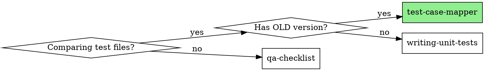

# Test Case Mapper

## Overview

**Test Case Mapper systematically compares legacy and refactored API test coverage.**

**Core principle:** Normalize → Compare → Categorize → Plan. Never skip normalization.

## When to Use



**Use for:**
- Migrating test cases from legacy API to new API
- Comparing two QA checklists for same functionality
- Creating approval workflow for test changes
- Planning unit tests after API refactor
- Tracking "what tests were removed" or "missing test coverage"

**When NOT to use:**
- Writing tests from scratch (no old version) → use `writing-unit-tests`
- Plain QA checklist creation → use `qa-checklist`
- API refactor with implementation → use `api-refactor-testing`

---

## Input Contract

User provides:
1. **OLD API test file** - Path to legacy test cases (e.g., `isat-landing-page-v2/qa-checklist/get-landing-page-details-v3-api.md`)
2. **NEW API test file** - Path to new test cases (e.g., `scholarship-landing-page/qa-checklist/landing-page-details-api.md`)

---

## Workflow

### Phase 1: Normalize to Common Language

Convert BOTH files to unified "Use Case" format:

```markdown
## Normalized Use Cases

| UC-ID | Category | Description | Source |
|-------|----------|-------------|--------|
| UC-001 | CATEGORY_LOOKUP | Lookup by valid ObjectId | OLD:UC-01.1 |
| UC-002 | CATEGORY_LOOKUP | Lookup by slug format | OLD:UC-01.2 |
| UC-003 | VALIDATION | Missing categoryId | NEW:TC-05 |
```

**Normalization Rules:**
- Strip file-specific formatting
- Assign consistent UC-ID scheme
- Map to common categories (VALIDATION, BUSINESS_LOGIC, SECURITY, EDGE_CASE)
- Track source (OLD/NEW + original ID)

---

### Phase 2: Compare & Categorize

For each normalized use case, determine status:

#### ✅ ACCEPTED (Approved)
Test exists in BOTH old and new → Automatically approved

| Status | OLD ID | NEW ID | Description | Modifications |
|--------|--------|--------|-------------|---------------|
| ✅ APPROVED | UC-01.1 | TC-11 | Category not found | Input field renamed |

#### ❌ DROPPED
Test exists in OLD only → Requires classification:

| Status | OLD ID | Description | Drop Reason | Action |
|--------|--------|-------------|-------------|--------|
| ⏳ PENDING | UC-04.2 | PHASE_RESTRICT block | `[ ] CODE_SUPPORT` `[ ] EXPECTED_BEHAVIOR` | Review required |

**Drop Reasons:**
- `CODE_SUPPORT` - Code no longer supports this scenario (feature removed)
- `EXPECTED_BEHAVIOR` - Behavior changed by design (intentional)

#### ➕ ADDED (Approved)
Test exists in NEW only → Automatically approved

| Status | NEW ID | Description | Reason Added |
|--------|--------|-------------|--------------|
| ✅ APPROVED | TC-05 | Missing categoryId | New validation rule |

---

### Phase 3: Deep Dive - ALL Helper Function Test Cases

Identify and list test cases for EVERY helper method at all levels:

**Structure:**
- **Level 1:** Main API/Orchestrator method
- **Level 2:** Service methods called by orchestrator
- **Level 3:** Internal helpers/private methods

For each method, enumerate: happy path, error cases, edge cases, null/empty handling.

> See [test-case-mapping-output.md](templates/test-case-mapping-output.md) for full example structure.

---

### Phase 4: Unit Test TODO Planner

Consolidate all test cases with implementation status:

| Level | Methods | Total Tests | Implemented | Pending |
|-------|---------|-------------|-------------|---------|
| Level 1 (API) | X | X | 0 | X |
| Level 2 (Services) | X | X | 0 | X |
| Level 3 (Helpers) | X | X | 0 | X |

For each method, create checkbox list with TC-IDs:
- `- [ ] TC-001: Description`

> See [test-case-mapping-output.md](templates/test-case-mapping-output.md) for complete TODO planner format.

---

## Output Strategy: Artifact-First Approach

> [!IMPORTANT]
> **Always create artifacts FIRST** in the brain folder, then copy to codebase after user approval.

### Step 1: Create Artifact (Always)

```
<appDataDir>/brain/<conversation-id>/test-case-mapping.md
```

Use `IsArtifact: true` when writing to ensure visibility in Antigravity IDE.

### Step 2: Copy to Codebase (After Approval)

```
<module>/qa-checklist/<api-name>-test-mapping.md
```

Only copy after user reviews and approves the artifact.

---

## Artifact-First Workflow

### Artifact Directory Structure

```
<appDataDir>/brain/<conversation-id>/
├── task.md                          # Track mapping progress
├── implementation_plan.md           # Document comparison approach
├── test-case-mapping.md             # Main mapping artifact
└── walkthrough.md                   # Final summary with proofs
```

### Workflow with task_boundary

**1. PLANNING Mode:**
- Create `implementation_plan.md` with:
  - OLD and NEW file paths
  - Normalization strategy
  - Categorization criteria
- Use `notify_user` for approval before execution

**2. EXECUTION Mode:**
- Create `test-case-mapping.md` as structured artifact
- Update `task.md` checkboxes as phases complete:
  - `[/]` Phase 1: Normalization
  - `[x]` Phase 2: Comparison
  - `[ ]` Phase 3: Helper Analysis
  - `[ ]` Phase 4: TODO Planner

**3. VERIFICATION Mode:**
- Create `walkthrough.md` with:
  - Summary metrics
  - Pending items requiring user decision
  - Links to generated mapping file

### Artifact Metadata

```markdown
---
ArtifactType: other
Summary: API test case mapping from [OLD] to [NEW] with X accepted, Y dropped, Z added cases
---
```

### User Review Points

Use `notify_user` with `PathsToReview` at:
1. **After normalization** - Confirm use case mappings are correct
2. **For PENDING dropped cases** - Get user decision on CODE_SUPPORT vs EXPECTED_BEHAVIOR
3. **Final mapping** - Request approval before generating TODO planner

### Example Progress Update

```markdown
## task.md

- [x] Normalize OLD test cases (15 use cases)
- [x] Normalize NEW test cases (18 use cases)
- [x] Compare and categorize
  - ✅ 12 Accepted
  - ⏳ 3 Dropped (2 pending review)
  - ➕ 6 Added
- [/] Deep dive helper analysis
- [ ] Generate TODO planner
```

---

## Quick Reference

### Status Icons

| Icon | Meaning |
|------|---------|
| ✅ APPROVED | Reviewed and accepted |
| ⏳ PENDING | Awaiting review/decision |
| ❌ DROPPED | Removed with reason |
| ⚠️ PARTIAL | Partially covered |
| ➕ ADDED | New test case |

### Drop Reason Decision Matrix

| Scenario | Drop Reason |
|----------|-------------|
| Feature completely removed | `CODE_SUPPORT` |
| Input schema changed fundamentally | `CODE_SUPPORT` |
| Behavior changed intentionally | `EXPECTED_BEHAVIOR` |
| Business rule updated | `EXPECTED_BEHAVIOR` |
| Endpoint deprecated | `CODE_SUPPORT` |

---

## Common Mistakes

| Mistake | Fix |
|---------|-----|
| Writing directly to codebase | Always create artifact in brain folder FIRST |
| Comparing without normalization | Always normalize to common UC format first |
| Skipping drop reason | Every dropped test MUST have CODE_SUPPORT or EXPECTED_BEHAVIOR |
| Missing helper method analysis | Include Level 2 (service) and Level 3 (helpers) analysis |
| No TODO checkboxes | Every planned test needs `- [ ]` for tracking |
| Ignoring test priority | Always categorize by Priority 1/2/3 |

---

## Example Usage

**Prompt:** "Map test cases from get-landing-page-details-v3-api.md to landing-page-details-api.md"

**Output (Artifact-First):**
1. `<appDataDir>/brain/<conversation-id>/test-case-mapping.md` - Artifact created first
2. User reviews and approves
3. `<module>/qa-checklist/<api-name>-test-mapping.md` - Copied to codebase

